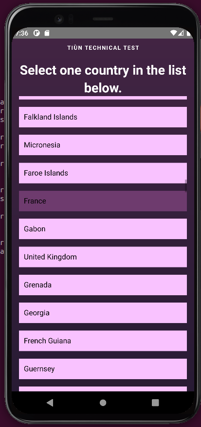
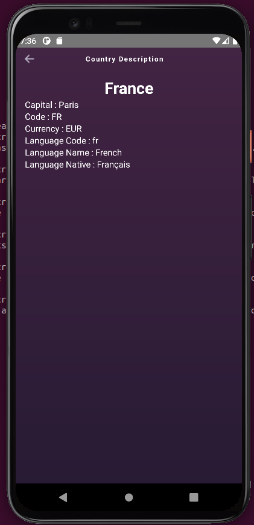
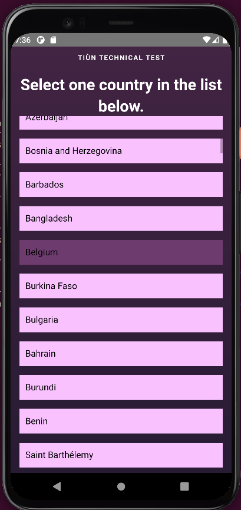
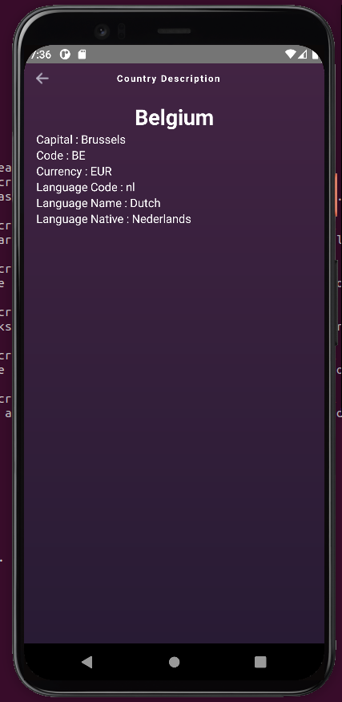

# Tiùn Technical test

## Goal 

- Using the [Ignite boilerplate](https://github.com/infinitered/ignite), create a simple iOS app in React Native with two screens. 
    - The first screen should be a list of countries sorted by their name. On press/click of a country name it should take you to the second screen.
    - The second screen is a screen that shows some data about the selected country. 
        - The country code, name, and some data about the languages of that country - the language code, language name and native language name.
    - The data for the screens should be pulled via GraphQL from the [Countries API](https://countries.trevorblades.com/.). [More Infos](https://github.com/trevorblades/countries)

## Get Started

Make sure you have Android development environment installed. [This link](https://reactnative.dev/docs/environment-setup) will help you setting up your environment.

In a terminal, run 
```shell
$ npx react-native start
```

In a second terminal,
```shell
$ npm run android
```

## Result

Select France            |  Show France Details
:-------------------------:|:-------------------------:
 |  

Select Belgium           |  Show Belgium Details
:-------------------------:|:-------------------------:
 | 
